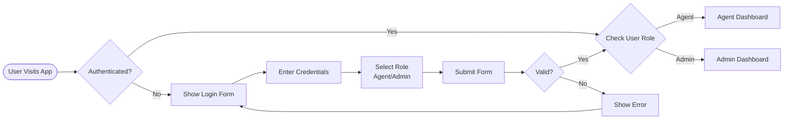
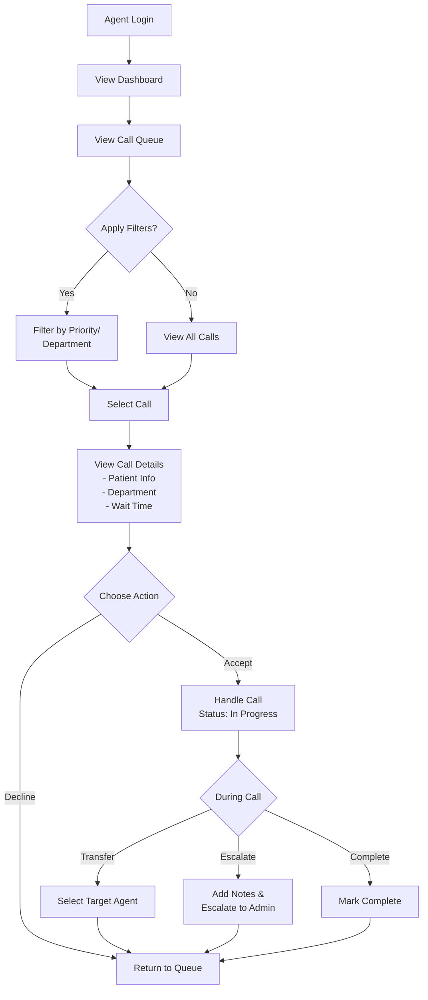
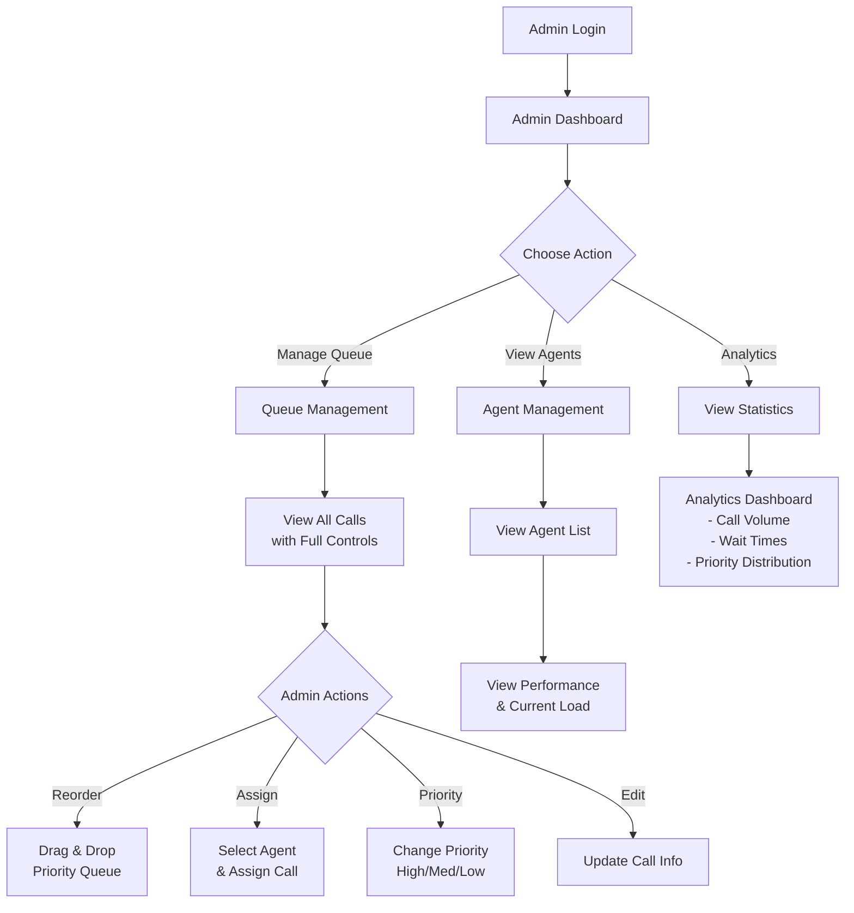
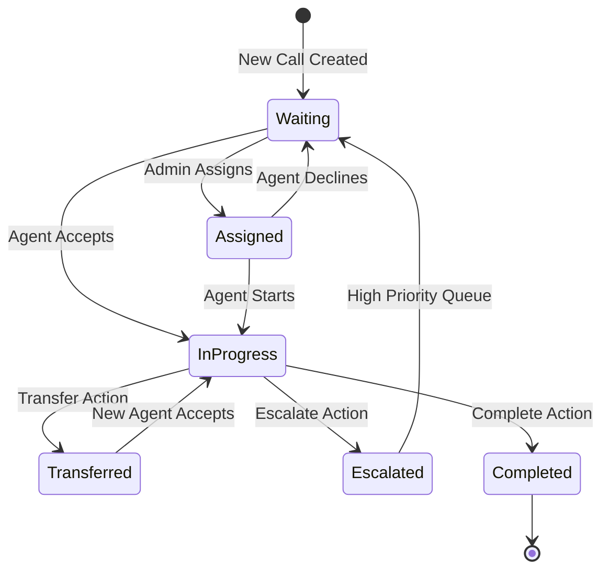
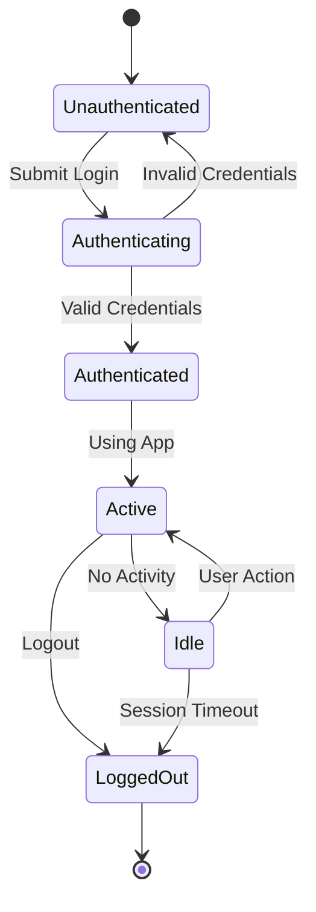

# Call Center Management - Component Hierarchy & User Journey

## 📋 Table of Contents
1. [Overview](#overview)
2. [Component Hierarchy](#component-hierarchy)
3. [User Journeys](#user-journeys)
4. [Navigation Flow](#navigation-flow)
5. [State Management](#state-management)
6. [Component Details](#component-details)

## Requirements
Call Queue Management Prototype Overview
This prototype focuses on managing a real-time queue of incoming calls for a support or triage team, with basic prioritization logic and assignment features. Key functionality includes:
User Authentication & Roles
 Agents and admins can log in. Agents receive call assignments, while admins manage call routing and priority settings.
Call Intake with Prioritization
 Calls enter a queue with metadata such as urgency level, patient status, or department. Each call is automatically assigned a priority (e.g., high, medium, low).
Admin Call Queue Control
 Admins can view, reorder, or manually override call priorities. They can assign specific calls to agents based on availability, expertise, or escalation rules.
Agent Assignment Dashboard
 Agents see a simplified interface listing their assigned calls, with priority indicators and basic call information.
Queue Visualization
 A live view displays the overall queue, color-coded by priority, and showing which agent is handling which call.
Juan Delgado left
Juan Delgado joined as a guest

## Overview

The Call Center Management System is a real-time queue management application designed for support and triage teams. It features role-based access for agents and administrators, with intelligent call prioritization and assignment capabilities.

### Key Features
- **Role-based Authentication**: Agent and Admin roles
- **Real-time Queue Management**: Live updates of call status
- **Priority-based Routing**: High, Medium, Low priority levels
- **Call State Management**: Waiting → Assigned → In Progress → Completed/Transferred/Escalated
- **Agent Dashboard**: Simplified interface for call handling
- **Admin Controls**: Override capabilities and manual assignment

## Component Hierarchy

```
App
├── AuthenticationScreen
│   ├── Card (Container)
│   ├── Form
│   │   ├── Input (Username)
│   │   ├── Input (Password)
│   │   └── Select (Role Selector)
│   └── Button (Login)
│
├── MainLayout
│   ├── Header
│   │   ├── Logo & Title
│   │   ├── UserInfo
│   │   └── LogoutButton
│   │
│   ├── Sidebar
│   │   ├── NavigationMenu
│   │   │   ├── QueueLink
│   │   │   ├── AgentsLink (Admin only)
│   │   │   └── AnalyticsLink (Admin only)
│   │   └── UserProfile
│   │
│   └── MainContent
│       ├── StatsCards
│       │   ├── TotalCallsCard
│       │   ├── WaitingCallsCard
│       │   ├── HighPriorityCard
│       │   └── AvgWaitTimeCard
│       │
│       ├── FilterBar
│       │   ├── PriorityFilter (Select)
│       │   ├── DepartmentFilter (Select)
│       │   └── SearchInput
│       │
│       └── QueueTable
│           ├── TableHeader
│           ├── TableBody
│           │   └── CallRow
│           │       ├── CallInfo
│           │       ├── PriorityBadge
│           │       ├── StatusBadge
│           │       └── ActionButtons
│           └── TablePagination
│
└── Modals
    ├── AssignModal (Admin)
    │   ├── AgentList
    │   └── AssignButton
    ├── TransferModal (Agent)
    │   ├── AvailableAgentsList
    │   └── TransferButton
    ├── EscalateModal (Agent)
    │   ├── Textarea (Notes)
    │   └── EscalateButton
    └── PriorityModal (Admin)
        ├── RadioGroup (Priority)
        └── UpdateButton
```

## User Journeys

### 🔐 Authentication Journey



### 👤 Agent User Journey

#### Primary Flow: Handling Calls


#### Component Navigation Path (Agent)
```
1. AuthenticationScreen
   └── Login as Agent
       └── MainLayout
           ├── Header (shows agent name)
           ├── Sidebar (limited menu)
           └── MainContent
               ├── StatsCards (view only)
               ├── FilterBar
               ├── QueueTable
               │   └── CallRow
               │       ├── Accept Button → Updates call status
               │       ├── Decline Button → Returns to queue
               │       └── (If accepted)
               │           ├── Transfer Button → TransferModal
               │           ├── Escalate Button → EscalateModal
               │           └── Complete Button → Updates status
               └── Modals (contextual)
```

### 👔 Admin User Journey

#### Primary Flow: Queue Management


#### Component Navigation Path (Admin)
```
1. AuthenticationScreen
   └── Login as Admin
       └── MainLayout
           ├── Header (shows admin name)
           ├── Sidebar (full menu)
           │   ├── Queue (default)
           │   ├── Agents
           │   └── Analytics
           └── MainContent
               ├── StatsCards (interactive)
               ├── FilterBar (advanced)
               ├── QueueTable (enhanced)
               │   └── CallRow
               │       ├── Assign Button → AssignModal
               │       ├── Priority Dropdown → Instant update
               │       ├── Edit Button → EditModal
               │       └── Drag Handle → Reorder queue
               ├── AgentManagement (when selected)
               │   ├── AgentTable
               │   └── PerformanceMetrics
               └── Analytics (when selected)
                   ├── ChartComponents
                   └── DetailedReports
```

## Navigation Flow

### Route Structure
```
/                       → Redirect to /login
/login                  → AuthenticationScreen
/dashboard              → MainLayout (role-based content)
  /dashboard/queue      → Queue Management (default)
  /dashboard/agents     → Agent Management (admin only)
  /dashboard/analytics  → Analytics Dashboard (admin only)
```

### State Transitions

#### Call State Machine


#### User Session States


## State Management

### Global State Structure
```javascript
{
  // Authentication State
  currentUser: {
    id: string,
    name: string,
    role: 'agent' | 'admin',
    permissions: string[]
  },
  
  // Call Queue State
  calls: [{
    id: string,
    patientName: string,
    department: string,
    patientStatus: string,
    priority: 'high' | 'medium' | 'low',
    waitTime: number,
    status: 'waiting' | 'assigned' | 'in-progress' | 'completed' | 'transferred' | 'escalated',
    assignedTo: string | null,
    phoneNumber: string,
    reason: string,
    createdAt: string,
    escalationNote?: string
  }],
  
  // Agent State
  agents: [{
    id: string,
    name: string,
    status: 'available' | 'busy' | 'offline',
    currentCalls: number,
    totalHandled: number,
    avgHandleTime: number
  }],
  
  // UI State
  ui: {
    selectedCall: string | null,
    filterPriority: 'all' | 'high' | 'medium' | 'low',
    filterDepartment: string | null,
    sortBy: 'waitTime' | 'priority' | 'createdAt',
    currentModal: null | 'assign' | 'transfer' | 'escalate' | 'priority',
    notifications: []
  }
}
```

## Component Details

### Core Components

#### 1. **QueueTable**
- **Purpose**: Central component for displaying and managing calls
- **Props**: `calls`, `onAction`, `userRole`, `filters`
- **Features**:
  - Sortable columns
  - Priority color coding
  - Real-time updates
  - Row actions based on role

#### 2. **CallRow**
- **Purpose**: Individual call representation
- **Props**: `call`, `onAccept`, `onDecline`, `onTransfer`, `onEscalate`, `onComplete`
- **State**: Tracks hover state for action visibility
- **Badges**: Priority (colored), Status (text-based)

#### 3. **StatsCards**
- **Purpose**: Quick overview of queue metrics
- **Updates**: Real-time via WebSocket (mocked with intervals)
- **Variants**: 
  - TotalCalls (blue)
  - WaitingCalls (yellow)
  - HighPriority (red)
  - AvgWaitTime (gray)

#### 4. **FilterBar**
- **Purpose**: Filter and search functionality
- **Components**:
  - Priority Select
  - Department Select
  - Search Input
  - Date Range Picker (future)

#### 5. **Modal Components**
- **AssignModal**: List of available agents with workload
- **TransferModal**: Available agents only
- **EscalateModal**: Note textarea + priority auto-set
- **PriorityModal**: Radio group selection

### Interaction Patterns

####